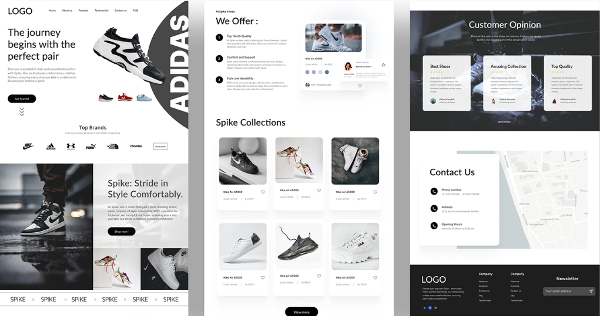

# Spike Shoes - E-Commerce Web App

Aplicación web e-commerce, interactiva y responsive con stack MERN, enfocada en la venta de calzado deportivo.

🚀 **Live Demo:** [Ver proyecto desplegado]

## Objetivo
Brindar a los usuarios una experiencia de compra de calzado deportivo, explorar productos desde una landing page atractiva, donde podrán autenticarse y acceder a un catálogo con flujo de compra.

## 🎨 Diseño
Diseño inspirado en el concepto de [ShoeSpike en Behance](https://www.behance.net/gallery/193698531/E-Commerce-Landing-Page-ShoeSpike-UI-UX)





**Innovaciones Propias sobre el diseño original:**
* **Flujo de Autenticación:** Se diseñó e implementó la experiencia completa de Login/Registro mediante modales navegables.
* **Sección FAQ (Preguntas Frecuentes):** Se maquetó y diseñó la sección de preguntas frecuentes desde cero, ya que figuraba en el Navbar del diseño original pero no contaba con una vista definida.
* **Internacionalización (i18n):** Se integró el soporte dinámico para cambio de idioma (Español / Inglés).


---
## 🛠️ Tecnologías Utilizadas

### Frontend
* **Stack:** React, TypeScript, Vite
* **Enrutamiento:** React Router Dom
* **Formularios y Validaciones:** React Hook Form, Zod, @hookform/resolvers
* **Estilos y Animaciones:** Tailwind CSS, Framer Motion
* **Internacionalización:** react-i18next
* **Iconos:** Tabler Icons

### Backend (En proceso)
* **Servidor y Arquitectura:** Node.js, Express
* **Base de Datos:** MongoDB

> [!NOTE]
> Actualmente el despliegue está enfocado en la arquitectura Frontend*

---
## ⚙️ Instalación y Configuración Local

* Clonar el repositorio
```bash
git clone https://github.com/TU_USUARIO/TU_REPOSITORIO.git

cd TU_REPOSITORIO
```

* Instalar dependencias
```bash
cd frontend
npm install
```

* Iniciar aplicación
```bash
npm run dev
```

---
### ✒️ Desarrollado por:

- Mi nombre
[Linkedin](https://linkedin/) 

